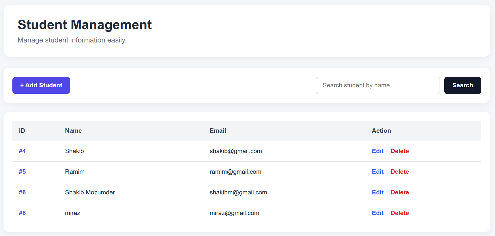
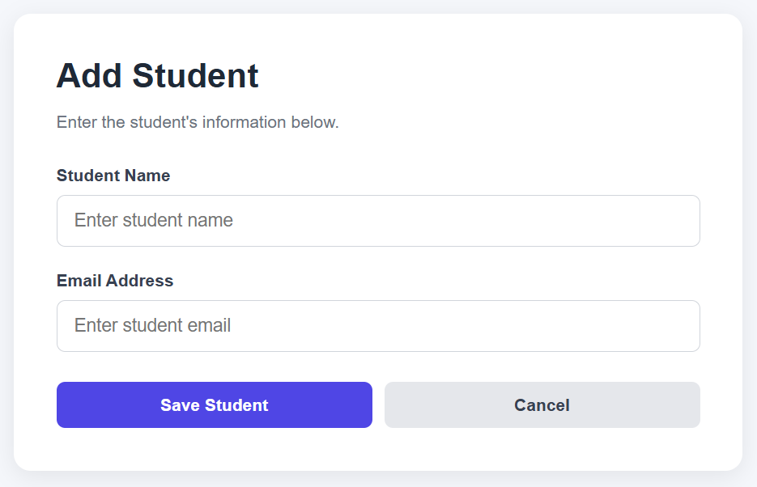
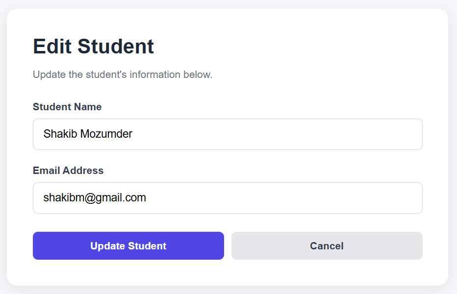

# PHP MVC Student Management System

A simple **Student Management System** built using **PHP, MySQL, HTML, CSS, and the MVC (Model-View-Controller) architecture**.

This project was developed to understand how a basic PHP application can be structured using MVC principles while implementing common student management operations such as **Create, Read, Update, Delete (CRUD), and Search**.

---

## 📌 Project Overview

The main goal of this project is to build a simple and organized Student Management System using PHP and MVC architecture.

The application allows users to:

- View all students
- Add new students
- Edit existing student information
- Delete students
- Search students by name
- Display success messages after operations
- Use a clean and responsive user interface

The project separates application logic into **Model, View, and Controller**, making the code easier to understand, maintain, and extend.

---

## 🚀 Features

### 1. Student List

The Student Management page displays all students stored in the MySQL database.

It shows:

- Student ID
- Student Name
- Email Address
- Edit option
- Delete option

---

### 2. Add Student

Users can add a new student by providing:

- Student Name
- Email Address

After submitting the form, the information is inserted into the MySQL database and the user is redirected back to the Student Management page.

---

### 3. Edit Student

Users can update an existing student's:

- Name
- Email

The existing student information is automatically displayed in the edit form before making changes.

---

### 4. Delete Student

Users can delete a student from the database.

A confirmation message is displayed before deletion to help prevent accidental deletion.

---

### 5. Search Student

Users can search for students by name.

The search functionality uses SQL `LIKE` to find matching student names.

For example, searching for:

```text
Nadia
```

can return students whose names contain "Nadia".

---

### 6. Success Messages

The system displays a success message after major operations.

Examples:

```text
Student added successfully!
Student updated successfully!
Student deleted successfully!
```

---

## 🏗️ MVC Architecture

This project follows the **Model-View-Controller (MVC)** architecture.

The basic flow of the application is:

```text
User / Browser
      |
      v
public/index.php
      |
      v
Controller
      |
      v
    Model
      |
      v
MySQL Database
      |
      v
    Model
      |
      v
Controller
      |
      v
    View
      |
      v
User / Browser
```

### Model

The Model is responsible for handling database-related operations.

In this project:

```text
app/models/Student.php
```

The Student model handles operations such as:

- Getting all students
- Getting a student by ID
- Creating a student
- Updating a student
- Deleting a student
- Searching students

---

### View

The View is responsible for displaying the user interface.

The student views are located in:

```text
app/views/students/
```

Files:

```text
index.php
create.php
edit.php
```

Their responsibilities are:

- `index.php` → Student Management page
- `create.php` → Add Student form
- `edit.php` → Edit Student form

---

### Controller

The Controller receives requests from the user and coordinates the Model and View.

The Controller is located at:

```text
app/controllers/StudentController.php
```

It handles actions such as:

```text
index()
create()
store()
edit()
update()
delete()
search()
```

---

## 📁 Project Structure

```text
mvc_demo/
│
├── app/
│   │
│   ├── controllers/
│   │   └── StudentController.php
│   │
│   ├── models/
│   │   └── Student.php
│   │
│   └── views/
│       └── students/
│           ├── index.php
│           ├── create.php
│           └── edit.php
│
├── config/
│   └── database.php
│
├── public/
│   ├── index.php
│   └── css/
│       └── style.css
│
├── screenshots/
│   ├── student-management.png
│   ├── add-student.png
│   └── edit-student.png
│
└── README.md
```

---

## 🗄️ Database

The project uses **MySQL** as the database.

### Database Name

```text
mvc_demo
```

### Table Name

```text
students
```

### Students Table

| Column | Type | Description |
|---|---|---|
| id | INT | Primary key with auto increment |
| name | VARCHAR(100) | Student name |
| email | VARCHAR(100) | Student email |

The basic table structure is:

```sql
CREATE TABLE students (
    id INT AUTO_INCREMENT PRIMARY KEY,
    name VARCHAR(100) NOT NULL,
    email VARCHAR(100) NOT NULL
);
```

---

## 🔄 CRUD Operations

This project implements the four basic CRUD operations.

| Operation | Function | Purpose |
|---|---|---|
| Create | `create()` | Add a new student |
| Read | `getAll()` | Display all students |
| Update | `update()` | Modify student information |
| Delete | `delete()` | Remove a student |

The application also includes:

```text
Search → search()
```

for finding students by name.

---

## 🔍 How Search Works

The search feature uses a parameterized SQL query with `LIKE`.

Example:

```sql
SELECT id, name, email
FROM students
WHERE name LIKE ?
```

The search keyword is wrapped with `%` characters so that partial matches can also be found.

For example:

```text
Search: Nadia
```

can match:

```text
Nadia
Nadia Akter
Md. Nadia
```

---

## 🎨 User Interface

The application includes three main interfaces:

1. Student Management
2. Add Student
3. Edit Student

The interface is styled using a custom CSS file:

```text
public/css/style.css
```

The layout is designed to be simple, clean, and responsive.

---

# 📸 Screenshots

## 1. Student Management

The Student Management page displays all students and provides options to search, edit, and delete students.



---

## 2. Add Student

The Add Student page allows users to enter a student's name and email address.



---

## 3. Edit Student

The Edit Student page allows users to update existing student information.



---

## 🛠️ Technologies Used

- **PHP**
- **MySQL**
- **HTML5**
- **CSS3**
- **Apache**
- **XAMPP**
- **Visual Studio Code**
- **phpMyAdmin**
- **MVC Architecture**

---

## ⚙️ Requirements

To run this project locally, you need:

- XAMPP
- PHP
- MySQL
- Apache
- Web browser
- Visual Studio Code or any code editor

---

## 💻 Installation & Setup

### Step 1: Install XAMPP

Install XAMPP and make sure the following services are running:

```text
Apache
MySQL
```

---

### Step 2: Clone or Copy the Project

Place the project inside the XAMPP `htdocs` directory.

Example:

```text
C:\xampp\htdocs\mvc_demo
```

---

### Step 3: Start Apache and MySQL

Open XAMPP Control Panel and start:

```text
Apache
MySQL
```

---

### Step 4: Create the Database

Open phpMyAdmin:

```text
http://localhost/phpmyadmin
```

Create a database named:

```text
mvc_demo
```

---

### Step 5: Create the Students Table

Select the `mvc_demo` database and run:

```sql
CREATE TABLE students (
    id INT AUTO_INCREMENT PRIMARY KEY,
    name VARCHAR(100) NOT NULL,
    email VARCHAR(100) NOT NULL
);
```

---

### Step 6: Configure Database Connection

Open:

```text
config/database.php
```

Make sure the database connection settings match your local MySQL configuration.

---

### Step 7: Run the Application

Open your browser and visit:

```text
http://localhost/mvc_demo/public/index.php
```

The Student Management page should appear.

---

## 🧪 Testing the Application

After running the application, the following operations can be tested:

### Add

```text
Add Student
      ↓
Enter Name & Email
      ↓
Save Student
      ↓
Student added successfully!
```

### Search

```text
Enter student name
      ↓
   Search
      ↓
Matching students displayed
```

### Edit

```text
Edit
 ↓
Modify Name / Email
 ↓
Update Student
 ↓
Student updated successfully!
```

### Delete

```text
Delete
   ↓
Confirmation
   ↓
  OK
   ↓
Student deleted successfully!
```

---

## 🎯 Learning Objectives

Through this project, we learned how to:

- Build a basic PHP web application
- Understand MVC architecture
- Separate application logic into Model, View, and Controller
- Connect PHP with MySQL
- Perform CRUD operations
- Use parameterized SQL queries
- Implement student search functionality
- Handle GET and POST requests
- Create reusable database methods
- Build simple and responsive interfaces using CSS
- Organize a PHP project using a structured folder hierarchy

---

## 🔮 Possible Future Improvements

The project can be extended with additional features such as:

- User authentication and login
- Student registration number
- Phone number
- Department
- Student profile
- Pagination
- Advanced search
- Form validation and error handling
- Database relationships
- Admin dashboard
- Bootstrap-based UI

---

## 👨‍💻 Author

**Shakib Mozumder**

Built as a learning project to understand **PHP MVC architecture, MySQL database integration, and CRUD application development**.

---

## 📄 License

This project is created for educational and learning purposes.
